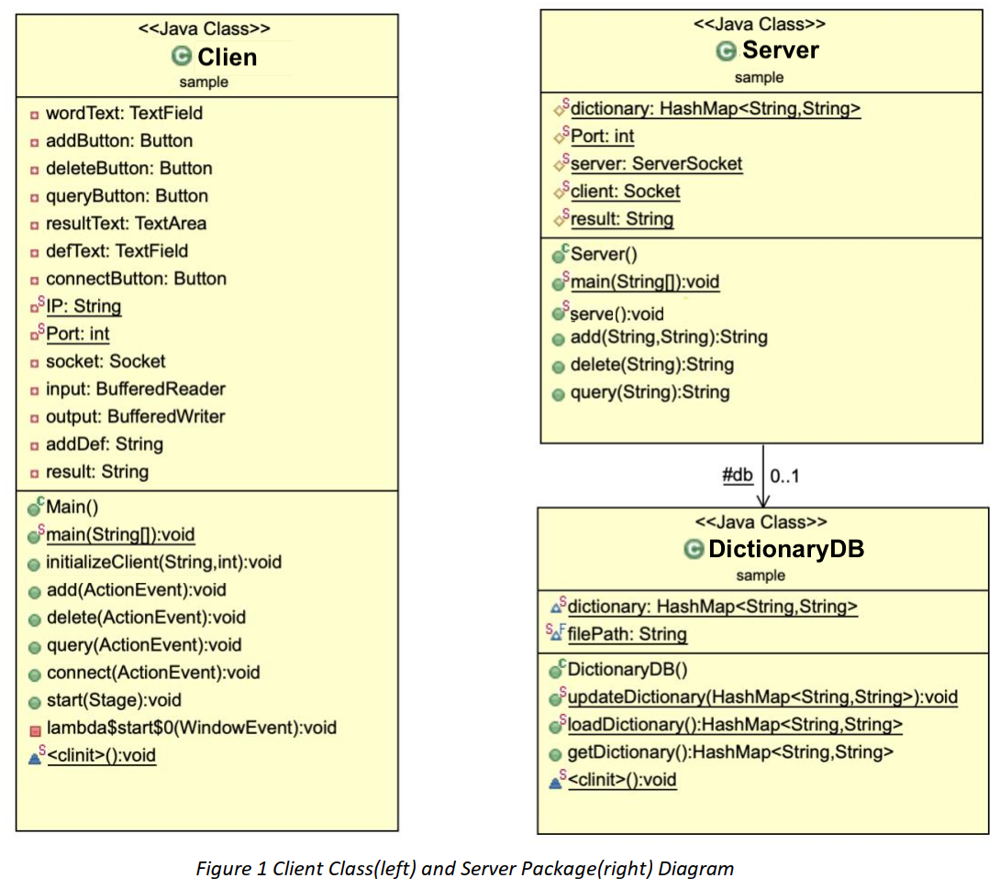
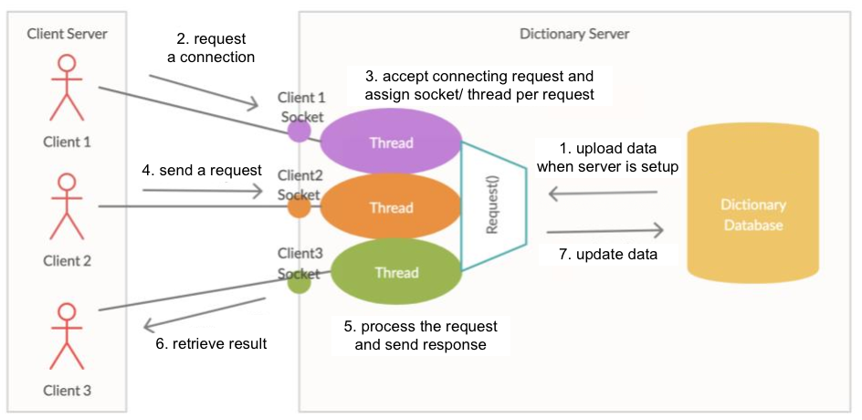
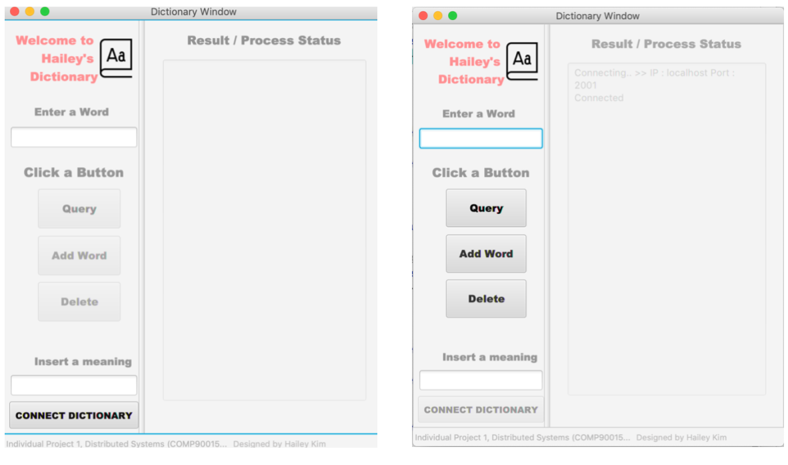

# Multi-threaded Dictionary Server

## About the project

This project aims to design and implement a dictionary server applying Connection-oriented Transmission Control Protocol (TCP). It serves requests (e.g., Add, Remove, and Search a word) from multiple users (clients). Multi-threading enables the concurrent access, while TCP enables the reliability of data transmission. To avoid system failure, potential error are handled.

## System design

It consists of three parts. One is process management; multi-threading and request handling. It generates sockets for client-server as well as controls the entire process in the main server. Another is file management; upload and download the dictionary file. A local data repository provides a dictionary database to the server. The other is the Graphical User Interface (GUI) application; JavaFX. It serves dictionary related service to users. These three components are bounded to communicate with each other through sockets. The used Dictionary DB in `dic.txt` is randomly generated by myself.

  
### Implementation

### Interaction between clients and server

### GUI design

 
  
## How to run
Make sure you modify `filePath` as your DB pathway in `class DictionaryDB` under `/DictionaryServer/src/sample/DictionaryDB.java`, then create separate jar files of the your modified code.

You can find my .jar files under `/DictionaryClient/out/artifacts/` and `/DictionaryServer/out/artifacts/` (Yet, they won't work on your local PC due to the DB filePath)

To start the server 
`java –jar DictionaryServer.jar <port>`

To start the client 
`java –jar DictionaryClient.jar <server-address> <server port>`
  
## Version 

Java 1.8.0 

----

Have fun! 🔎 📙
